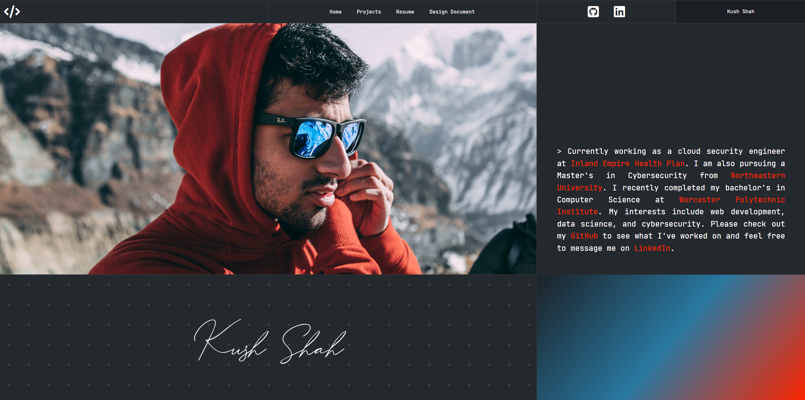

# Personal Homepage

**Author:** Kush Shah

**Class Link:** https://johnguerra.co/classes/webDevelopment_online_fall_2025/

**Project Objective:**
This project is a personal homepage created as part of the CS5610 Web Development course. The goal is to demonstrate proficiency in HTML, CSS, and JavaScript by building a multi-page personal website that showcases projects, resume highlights, and other relevant information.

- The page made with generative AI is the projects page (model used gpt-5-codex high with full agent access)

  Prompts:
  1. `Add a new page to the site, remember to update the nav elements on all other pages. The new page should be called Projects. The top of the page should be the console creative element. Followed by the projects section on https://www.kushshah.net/#projects including the js to make the chips clickable and filters.`
  2. `clicking on the chips should filter the projects`
  3. `the projects should be removed if the filter does not apply`

- The design document content was also produced with generative AI using the requirements listed on Canvas.

**Screenshot:**

**Creative Feature**
On the home page, the about section is "typed" out using vanilla JavaScript with a skip-on-click behavior.

**Instructions to Build/Run:**
1. Clone or download this repository to your local machine.
2. Serve the `personal-homepage` directory with a static file server so ES modules load correctly (e.g., `npx http-server personal-homepage -p 8080`).
3. Visit `http://localhost:8080/index.html` in your browser.
